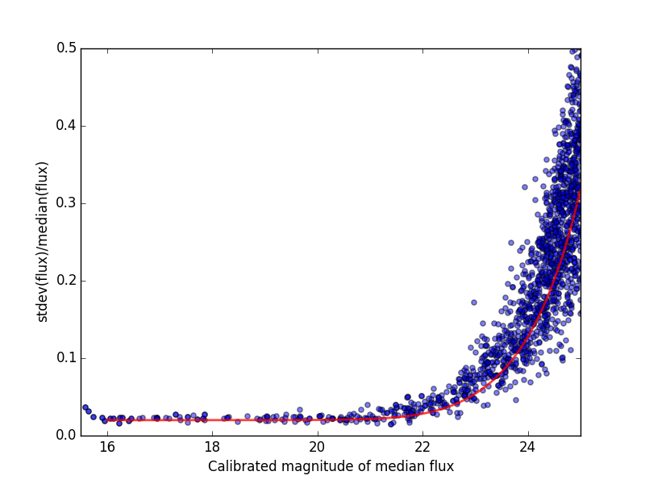

First generate the inputs to phosim and start them generating (read the phosim docs for the generation part)

The script to do this resides in this repository and will only generate input files for the first 9 observations.
You'll also need the OpSim sqlite repository from [this page](https://confluence.lsstcorp.org/display/SIM/OpSim+Datasets+for+Cadence+Workshop+LSST2015)
```
$> setup sims_catUtils
$> python generatePhosimInput.py
```
There are some really bright stars that take forever to simulate.  This could be done with a cut
in the original phosim generation script.  I just haven't done it.
```
$> awk '{if(NR < 21 || $5 > 13) print $0}' phosim_input_840.txt >phosim_input_840_stripped.txt
.
.
.
$> awk '{if(NR < 21 || $5 > 13) print $0}' phosim_input_848.txt >phosim_input_848_stripped.txt
```
Build the index files for astrometry.net.  I used a hacked up version of one of the instance files.  The
result reference file looks like:
```
#id RA DEC r starnotgal
992887068677 52.9947735 -27.382232 26.033589 1
1605702564869 53.0078711 -27.3569529 27.6050492 1
1277139994629 52.9968482 -27.3624426 24.8995206 1
1704223204357 53.0228395 -27.3272621 23.6719418 1
1605697082373 53.0222088 -27.3339376 21.7187844 1
1605694183429 52.9937238 -27.326823 25.2046127 1
1605694345221 52.9976002 -27.3269112 19.2262528 1
1277138139141 52.9994853 -27.3337649 24.169532 1
...
```
Setup astrometry_net and pyfits packages and build the files.
```
$> setup astrometry_net
$> setup pyfits
$> text2fits.py ref.txt ref.fits -f 'kdddj'
$> export P=1028150
$> build-astrometry-index -i ref.fits -o index-${P}00.fits -I ${P}00 -P 0 -S r -n 100 -L 20 -E -j 0.4 -r 1 > build-00.log
$> build-astrometry-index -1 index-${P}00.fits -o index-${P}01.fits -I ${P}01 -P 1 -S r -L 20 -E -M -j 0.4 > build-01.log &
$> build-astrometry-index -1 index-${P}00.fits -o index-${P}02.fits -I ${P}02 -P 2 -S r -L 20 -E -M -j 0.4 > build-02.log &
$> build-astrometry-index -1 index-${P}00.fits -o index-${P}03.fits -I ${P}03 -P 3 -S r -L 20 -E -M -j 0.4 > build-03.log &
$> build-astrometry-index -1 index-${P}00.fits -o index-${P}04.fits -I ${P}04 -P 4 -S r -L 20 -E -M -j 0.4 > build-04.log
$> mkdir and_files
$> vi and_files/andConfig.py
$> mv index-10281500* and_files
```
The andConfig.py looks like this:
```
root.starGalaxyColumn = "starnotgal"
filters = ('u', 'g', 'r', 'i', 'z')
root.magColumnMap = dict([(f,'r') for f in filters])
root.indexFiles = ['index-102815000.fits', 'index-102815001.fits', 'index-102815002.fits',
'index-102815003.fits',
'index-102815004.fits']
```
Now process the data.  I have only gotten through coaddition.  First you'll need to build the stack using tickets/DM-4302
of obs_lsstSim.  In order to patch a branch version onto a pre-existing stack you can do something like the following.

1. Build a master stack.  I suggest using [lsstsw](https://confluence.lsstcorp.org/display/LDMDG/The+LSST+Software+Build+Tool).
2. Set up the stack: e.g. `$> setup obs_lsstSim -t bNNNN`
3. Clone the package you want to patch on top of your stack `$> clone git@github.com:lsst/obs_lsstSim.git; cd obs_lsstSim`
4. Get the branch: `$> checkout tickets/DM-4302`
5. Set up just (-j) the cloned package (since the rest of the packages are already set up): `$> setup -j -r .`
6. Build the cloned package (this is necessary even for pure python packages): `$> scons opt=3`
7. Optionally install it in your stack: `$> scons install declare`

This assumes the simulated images have landed in a directory called ```images```
in the current directory.  In the images directory, you'll need a ```_mapper``` file with contents
```
lsst.obs.lsstSim.LsstSimMapper
```
The above file will tell the stack where to put the raw files and eimages.
```
# Setup the stack environment.  This will make the LsstSimMapper class available
$> setup obs_lsstSim

# Ingest the images from a directory called images to a repository called input_data
# there are some config overrides in the ingest.py file
$> ingestImages.py images images/lsst_*.fits.gz --mode link --output input_data

# Setup the reference catalog for photometric and astrometric calibration
$> setup -m none -r and_files astrometry_net_data
```
In order to try out the cookbook, you can download the input_data repository and the and_files astrometry_net_data files as a tarball from [here](https://lsst-web.ncsa.illinois.edu/~krughoff/data/twinkles_first_9.tar.gz).
```
# Create calibrated images from the input eimages.  This will write to a repository called output_data.  The --id argument
# defines the data to operate on.  In this case, it means run visit 840 and 841 and 842 and ....  There can be more than one
# --id argument.
$> processEimage.py input_data/ --id visit=840^841^842^843^844^845^846^847^848 --output output_data

# Make a skyMap to use as the basis for the astrometic system for the coadds.  This can't be done up front because
# makeDiscreteSkyMap decides how to build the patches and tracts for the skyMap based on the data.
$> makeDiscreteSkyMap.py output_data/ --id visit=840^841^842^843^844^845^846^847^848

# Coadds are done in two steps.  Step one is to warp the data to a common astrometric system.  The following does that.
# The config option is to use background subtracted exposures as inputs.
$> makeCoaddTempExp.py output_data/ --selectId visit=840^841^842^843^844^845^846^847^848 --id filter=r patch=0,0 tract=0 --config bgSubtracted=True

# This is the second step which actually coadds the warped images.  The doInterp config option is required if there
# are any NaNs in the image (which there will be for this set since the images do not cover the whole patch).
$> assembleCoadd.py output_data/ --selectId visit=840^841^842^843^844^845^846^847^848 --id filter=r patch=0,0 tract=0 --config doInterp=True

# Detect sources in the coadd and then merge detections from multiple bands (we only have one here).
$> detectCoaddSources.py output_data/ --id tract=0 patch=0,0 filter='r'
$> mergeCoaddDetections.py output_data/ --id tract=0 patch=0,0 filter='r'

# Do measurement on the sources detected in the above steps and merge the measurements from multiple bands (we only have one).
$> measureCoaddSources.py output_data/ --id tract=0 patch=0,0 filte='r'
$> mergeCoaddMeasurements.py output_data/ --id tract=0 patch=0,0 filter='r'

# Use the detections from the coadd to do forced photometry on all the single frame data.
$> forcedPhotCcd.py output_data/ --id tract=0 filter='r' visit=840^841^842^843^844^845^846^847^848 sensor=1,1 raft=2,2 --config measurement.doApplyApCorr='yes'
```
Once the forced photometry is done, you can look at the output by loading the measurements using the butler.  [This script](plot_point_mags.py) shows how to start looking at the measurements.  It produces the following image.  Note that the line is *not* a fit to the data.  It is the result of a naive approximation.  Specifically, the assumptions are flat spectrum (zero AB color), S/R = 5. at r=24.5, and a systematic floor at 2%.


